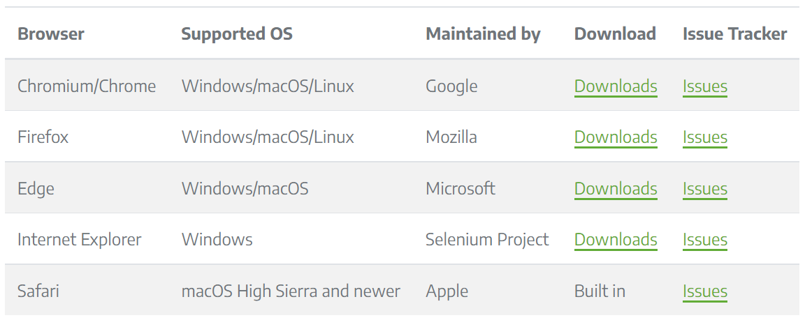

# 上海大学每日一报补报脚本

***免责申明：代码仅供学习交流目的使用！！！***

## 原理

基于python+selenium，自动化脚本打开浏览器，模拟用户点击进行补报。

第一次使用需要手动把最早的一天补报完整，每日一报网页会保留前一天的地址信息，所以之后十几天的补报就可以全部交给脚本完成。

## 使用

- python3

- 安装selenium库 `pip install selenium`

- 下载对应的浏览器的驱动，selenium支持的系统和浏览器如下图，详见[Selenium官网说明](https://www.selenium.dev/documentation/webdriver/getting_started/install_drivers/)

  

- 将下载下来的驱动放到项目文件夹中

- 修改`代码第6行`对应的浏览器名称和驱动文件名称

	

- 修改`代码第9 10行`的学号 密码

- （可选）`代码第25行`的`fineui_8-inputEl-icon`为在上海（不进学校）按钮；`fineui_9-inputEl-icon`为不在上海按钮，根据需要修改

- 运行脚本